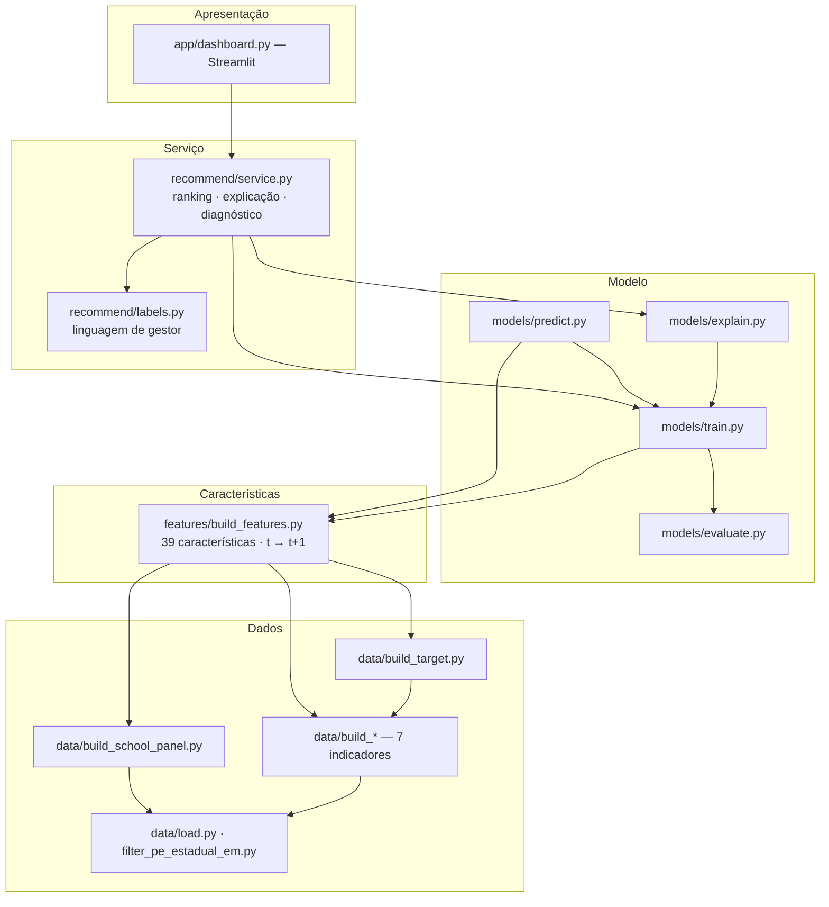
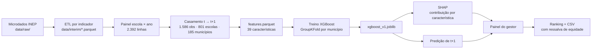
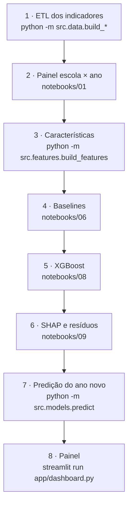

# Sistema de Priorização de Escolas em Risco de Evasão — Pernambuco


Sistema preditivo que identifica **antecipadamente** as escolas estaduais de Ensino Médio de
Pernambuco com maior risco de abandono, e explica cada indicação. Desenvolvido como TCC de
Especialização em Engenharia de Software (PUC-SP).

A unidade de análise é a **escola**, não o aluno: os dados públicos existem nesse nível, o
gestor decide nesse nível, e o volume resultante permite um sistema auditável ponta a ponta.

---

## Visão geral

A taxa média de abandono da rede vem caindo — 2,05% (2022), 1,37% (2023), 0,96% (2024) — mas
a média esconde o problema. Em 2024:

- **2.043 alunos** abandonaram o Ensino Médio na rede estadual;
- **67% das escolas** não registraram nenhum caso;
- as **79 escolas mais críticas** (10% da rede) concentraram **76%** dos alunos que saíram.

O problema é concentrado, não difuso. Daí a decisão que orienta todo o projeto: o sistema
precisa acertar **quem está no topo da lista**, não estimar bem a média. Um sistema que
respondesse "zero" para toda escola erraria pouco na média e seria inútil ao gestor.

### O que o sistema não faz

Prever evasão não é o mesmo que conhecê-la. O sistema encontra **associações, não causas**.
Ele não antecipa a trajetória de nenhum estudante e não garante que uma escola apontada terá
abandono alto. Entre as escolas que ele marca como prioritárias, cerca de metade não está
entre as mais críticas. A lista diz onde olhar primeiro; quem confirma é a visita à escola.

---

## Funcionalidades

- **ETL reprodutível** de sete fontes públicas do INEP — Censo Escolar, taxas de rendimento,
  INSE, IRD, TDI e AFD, além de IED e ICG, avaliados e descartados por não agregarem sinal.
- **39 características** por escola, com imputação por mesorregião × ano e rastreabilidade
  documentada da amostra (2.392 → 1.586 observações).
- **Previsão do ano seguinte** por XGBoost, comparada a três modelos de referência sob
  validação que impede vazamento temporal e espacial.
- **Explicação individual** de cada previsão via SHAP, traduzida para linguagem de gestor.
- **Diagnóstico de resíduo**: separa escolas que abandonam mais (alerta) ou menos
  (resiliente) do que o perfil faria esperar.
- **Ressalva de equidade embutida** — o viés medido em escolas indígenas e quilombolas
  acompanha a predição na tela e viaja no CSV exportado.
- **Painel Streamlit** com ranking filtrável, detalhe por escola e panorama da rede.
- **Modo predição** para anos ainda não observados (2024 → 2025).

---

## Tecnologias

Versões **fixadas com `==`** por exigência de reprodutibilidade — ver
[Ambiente de referência](#ambiente-de-referência).

| Tecnologia | Versão | Propósito |
|---|---|---|
| Python | 3.14 | Linguagem base |
| pandas | 3.0.3 | Manipulação de dados |
| pyarrow | 24.0.0 | Leitura e escrita de Parquet |
| numpy | 2.4.6 | Computação numérica |
| scikit-learn | 1.8.0 | Pipelines, validação cruzada, baselines |
| xgboost | 3.2.0 | Modelo adotado |
| shap | 0.51.0 | Explicabilidade |
| scipy | 1.17.1 | Testes estatísticos |
| streamlit | 1.57.0 | Painel do gestor |
| plotly | 6.7.0 | Gráficos do painel |
| matplotlib / seaborn | 3.10.9 / 0.13.2 | Figuras da monografia |
| openpyxl | 3.1.5 | Planilhas do INEP |
| pytest / pytest-cov | 9.0.3 / 7.1.0 | Testes automatizados |

---

## Estrutura do projeto

```
monografia/
├── evasao-escolar/                 # o sistema
│   ├── src/
│   │   ├── data/                   # camada de dados
│   │   │   ├── config.py               # caminhos, constantes, mapeamentos
│   │   │   ├── load.py                 # leitura bruta do Censo
│   │   │   ├── filter_pe_estadual_em.py
│   │   │   ├── build_school_panel.py   # painel escola × ano
│   │   │   ├── build_taxas_rendimento.py
│   │   │   ├── build_inse.py · build_ird.py · build_tdi.py · build_afd.py
│   │   │   ├── build_esforco_docente.py · build_complexidade_gestao.py
│   │   │   └── build_target.py         # alvo longitudinal t → t+1
│   │   ├── features/
│   │   │   └── build_features.py       # as 39 características + rastreabilidade
│   │   ├── models/
│   │   │   ├── train.py                # pipelines, GroupKFold, split temporal
│   │   │   ├── evaluate.py             # Precision@K, Spearman
│   │   │   ├── explain.py              # SHAP e análise de resíduos
│   │   │   └── predict.py              # modo predição (ano não observado)
│   │   └── recommend/
│   │       ├── service.py              # regra de negócio do painel
│   │       └── labels.py               # nome técnico → linguagem de gestor
│   ├── app/dashboard.py            # camada de apresentação (Streamlit)
│   ├── notebooks/                  # 15 scripts de análise (.py, não .ipynb)
│   ├── tests/                      # 138 testes pytest
│   ├── data/                       # raw/ interim/ processed/ — fora do Git
│   ├── models/                     # *.joblib — fora do Git
│   ├── reports/                    # métricas .csv + figuras/ (72 PNGs)
│   └── requirements.txt
├── documentos/                     # a monografia e o material de escrita
│   ├── monografia-artur-oliveira-engenharia-de-software-2026.docx   # documento canônico
│   ├── referencias/                    # 21 PDFs + mapa citação → parágrafo
│   ├── COMENTARIOS_ORIENTADOR.md       # os 13 comentários (SS1–SS13)
│   └── PLANO_DE_FINALIZACAO.md         # pendências por tier
├── .claude/skills/                 # skills de validação (seção própria abaixo)
└── CLAUDE.md                       # diretrizes do projeto
```

---

## Arquitetura

### Visão estrutural — camadas

Fluxo estritamente unidirecional, sem ciclos. A regra de negócio vive fora da interface, o
que permite testá-la sem subir o Streamlit.



### Visão de fluxo — do dado bruto à lista priorizada



### Visão de execução — sequência do pipeline



### Anti-vazamento — a garantia central

Duas regras atravessam todo o código e são travadas por teste:

1. **Temporal** — características do ano `t` preveem abandono em `t+1`. O ano mais recente
   nunca sobra como ano de origem no treino.
2. **Espacial** — `GroupKFold` agrupado por `CO_MUNICIPIO`. A mesma cidade nunca aparece em
   treino e teste ao mesmo tempo: escolas vizinhas se parecem, e isso inflaria o desempenho.

---

## Instalação

### Pré-requisitos

- Python 3.14 (ambiente de referência: Windows)
- Microdados do INEP em `evasao-escolar/data/raw/`, nas subpastas `censo/`,
  `taxas_rendimento/`, `inse/`, `indicador_regularidade_docente/`,
  `taxa_distorcao_idade/`, `adequacao_formacao_docente/`, `esforco_docente/` e
  `complexidade_gestao_escola/` — edições de 2022 a 2024, cerca de 1 GB no total.
  Os arquivos não são versionados; cada subpasta tem um `README.md` com o link
  direto de download e o nome exato que o arquivo precisa ter. Comece por
  [`evasao-escolar/data/raw/README.md`](evasao-escolar/data/raw/README.md).

### Passos

```bash
git clone <repositório>
cd monografia/evasao-escolar

python -m venv .venv
.venv\Scripts\activate            # Windows
# source .venv/bin/activate       # Linux/macOS

pip install -r requirements.txt
```

Se os nomes dos arquivos do INEP diferirem, renomeie conforme o `README.md` da subpasta ou
ajuste `src/data/config.py` — o `load.py` também resolve por padrão de nome, porque o INEP
muda a nomenclatura entre edições. O caso conhecido é o AFD de 2023, publicado como
`AFD_ESCOLAS_2023_v1.1.xlsx`.

### Ambiente de referência

O `requirements.txt` fixa **todas** as versões com `==`, não `>=`. O motivo é concreto e já
custou uma rodada de retrabalho: a partição do `GroupKFold` mudou entre versões do
scikit-learn e **alterou métricas publicadas sem que dados ou código mudassem**. A prova foi
o modelo "sem sistema" (média da rede), que não usa nenhuma característica e depende só da
partição — ele também mudou.

**Não regere número do Capítulo 6 fora deste ambiente.** Confira antes com
`/validar-ambiente`.

---

## Uso

Todos os comandos rodam a partir de `evasao-escolar/`, com o venv ativo.

### Pipeline completo

```bash
# 1. ETL — um entry-point por indicador
python -m src.data.build_taxas_rendimento
python -m src.data.build_inse
python -m src.data.build_ird
python -m src.data.build_tdi
python -m src.data.build_afd
python -m src.data.build_esforco_docente
python -m src.data.build_complexidade_gestao

# 2. Painel escola × ano
python notebooks/01_exploracao_inicial.py

# 3. Características → data/processed/features.parquet
python -m src.features.build_features

# 4. Modelos
python notebooks/06_baseline_modelos.py     # Dummy, Ridge, Random Forest
python notebooks/08_tuning_xgboost.py       # XGBoost → models/xgboost_v1.joblib
python notebooks/09_shap_diagnostico.py     # SHAP + resíduos
```

> `src/data/build_school_panel.py` **não** tem bloco `__main__` — o painel é montado pelo
> notebook 01, apesar de comentários antigos citarem `python -m src.data.build_school_panel`.

### Prever um ano ainda não observado

```bash
python -m src.models.predict 2024      # prevê o abandono de 2025
```

O ano é **argumento posicional**, não `--year`. Saídas em `data/processed/`:
`predicao_abandono_2025.csv` (ranking com posição, escola, município e risco) e
`features_predicao_2025.parquet`.

```
=== Risco de abandono previsto para 2025 ===
Escolas: 791  |  risco médio previsto: 0,85%

Top 10 escolas de maior risco:
    1.  23,7%  ESCOLA ESTADUAL ORORUBA                    (Pesqueira)
    2.  12,6%  ESCOLA JOAQUIM ROSENO DOS SANTOS           (Águas Belas)
    ...
```

> As primeiras posições costumam ser escolas de localização diferenciada — exatamente o
> grupo em que o modelo **superestima** o risco. A ressalva acompanha cada saída.

### Painel do gestor

```bash
streamlit run app/dashboard.py        # http://localhost:8501
```

Três abas: **Ranking de risco** (filtros por mesorregião, município e nome, download em
CSV), **Detalhe da escola** (contribuição de cada característica e diagnóstico de resíduo) e
**Panorama** (distribuição do risco e equidade por localização).

---

## Resultados

O critério é **ordenação**, não erro absoluto. Isso não é preferência de estilo — é
consequência dos números.

### Teste temporal (características de 2023 → abandono de 2024)

| Modelo | RMSE | Spearman | Precision@10% |
|---|---|---|---|
| Sem sistema (média da rede) | **2,540** | — | 0,089 |
| Ridge | 2,891 | 0,330 | 0,380 |
| Random Forest | 2,751 | 0,343 | 0,405 |
| **XGBoost (adotado)** | 2,874 | **0,348** | **0,418** |

Duas leituras que o projeto assume abertamente:

- O XGBoost tem **RMSE pior que o dummy** e R² negativo (−0,33). O ganho está no ranking:
  0,418 contra 0,089 do acaso — **4,7×**.
- Os três modelos são **estatisticamente indistinguíveis**. Na validação repetida o Random
  Forest lidera o Spearman (0,431 contra 0,416) e o Ridge lidera o Precision@K (0,513 contra
  0,504). A escolha do XGBoost se apoia no teste temporal e no SHAP construído sobre ele —
  **não** em superioridade geral.

### Desempenho por transição anual

| Cenário | Spearman | Precision@K | ROC-AUC |
|---|---|---|---|
| 2022 → 2023 | 0,469 | 0,627 | 0,901 |
| 2023 → 2024 | 0,367 | 0,381 | 0,813 |

O desempenho **depende do ano**. A queda acompanha a redução do abandono médio da rede
(1,36% → 0,88%): com as escolas mais próximas de zero, sobra menos sinal para ordená-las.

### Limitação de equidade — medida, não hipotética

Diagnóstico de resíduos no teste temporal:

| Grupo | Escolas | Abandono real | Previsto | Resíduo |
|---|---|---|---|---|
| **Diferenciada (indígena/quilombola)** | 41 | 4,96% | **11,08%** | **−6,12 p.p.** |
| Rural | 69 | 0,88% | 0,50% | +0,38 |
| Urbana | 679 | 0,63% | 0,56% | +0,07 |

O modelo prevê **2,2× o abandono real** nesse grupo, enquanto urbanas e rurais ficam
calibradas. Agrava que `is_loc_diferenciada` é a característica de **maior ganho** no XGBoost
(0,239) — a flag do grupo virou atalho preditivo. A ressalva aparece no painel em três pontos
e viaja no CSV exportado.

---

## Testes

```bash
pytest                                        # 138 testes, ~25 s
pytest tests/test_build_target.py             # casamento temporal t → t+1
pytest tests/test_models.py                   # vazamento espacial entre folds
pytest tests/test_explain.py                  # aditividade SHAP
pytest tests/test_rastreabilidade_amostra.py  # cadeia 2.392 → 1.586
pytest tests/test_recommend.py                # ranking, explicação, ressalva de equidade
```

A suíte cobre os erros que **não se manifestam em tempo de execução** — num sistema que
aprende com dados, um erro de preparação não quebra a execução: produz em silêncio um modelo
inválido que continua respondendo normalmente.

Verificação forte de reprodutibilidade: o `features.parquet` em disco é **bit-idêntico** ao
regerado pelo código atual (diferença numérica máxima 0,0).

---

## Skills de validação

O projeto traz skills executáveis em `.claude/skills/`, cada uma com linha de base
verificada. Rodar nesta ordem antes de qualquer entrega:

| Skill | O que valida | Estado atual |
|---|---|---|
| `/validar-ambiente` | versões contra os pins do `requirements.txt` | 15/15 na versão fixada |
| `/validar-numeros` | cada número do `.docx` contra o artefato que o gera | 124 OK · 0 divergências |
| `/validar-documento` | numeração, terminologia, placeholders pendentes | Figuras 1–20, Quadros 1–11 |
| `/validar-escrita` | sintaxe PT-BR, ABNT, clareza, marcadores de escrita automática | 0 ocorrências · 0 indícios |
| `/revisar-projeto` | auditoria de código em 7 pilares | 6 ✅ · 1 ressalva |
| `/prever-novo-ano` | gera o ranking de um novo ano letivo | — |
| `/gerar-readme` | regenera este arquivo a partir do código | — |

**`/validar-ambiente` vem primeiro**: número gerado em ambiente errado é número inválido.

---

## Implantação

O sistema roda hoje como aplicação Streamlit local, a partir do venv de referência.

**Contêiner ainda não implementado.** O empacotamento em Docker está declarado como trabalho
futuro na monografia — é a única lacuna técnica assumida. Um `Dockerfile` precisaria fixar
Python 3.14, instalar de `requirements.txt` sem resolver versões, e montar `data/` e
`models/` como volumes, já que ambos ficam fora do Git.

Para uso em produção na Secretaria, a monografia registra requisitos ainda em aberto:
monitoramento contínuo do modelo com reavaliação periódica, detecção de deriva dos dados —
o abandono caiu de 2,05% para 0,96% em dois anos, e foi isso que degradou a previsão de
magnitude — e integração aos sistemas internos para envio automático de alertas.

---

## Como contribuir

1. **Ambiente antes de tudo.** Rode `/validar-ambiente`. Não regere métrica fora do ambiente
   de referência.
2. **Regra de negócio fora da interface.** Lógica nova vai em `src/recommend/service.py` e é
   testada sem subir o Streamlit. O `app/` apenas renderiza.
3. **Anti-vazamento é inegociável.** Nenhuma mudança pode misturar municípios entre treino e
   teste, nem usar informação de `t+1` como característica.
4. **Todo número do texto vem de artefato.** Se um valor novo entrar na monografia, adicione a
   checagem em `notebooks/15_varredura_numeros.py` — não confira à mão uma vez só.
5. **Teste novo obriga a atualizar a contagem** nos quatro pontos do `.docx`: o bloco 10 da
   varredura não trava esse número, e ele já ficou defasado duas vezes por isso.
6. **Linguagem de gestor.** Use "característica", não "feature" nem "informação" — é o
   comentário SS7 do orientador. Métrica técnica aparece nomeada pelo que mede.
7. Rode `pytest` antes de abrir PR.

---

## Licença

**Não definida.** O repositório não contém arquivo `LICENSE`; até que o autor escolha uma, a
obra permanece sob direitos autorais reservados. Os microdados do INEP têm licença própria e
são de acesso público.

---

## Créditos e referências

**Autor:** Artur Oliveira Santiago
**Orientador:** prof. Silvio Luiz Stanzani
**Instituição:** Pontifícia Universidade Católica de São Paulo — Especialização em Engenharia
de Software

**Dados:** Instituto Nacional de Estudos e Pesquisas Educacionais Anísio Teixeira (INEP) —
Censo Escolar da Educação Básica, Taxas de Rendimento Escolar e Indicadores Educacionais
(INSE, IRD, TDI, AFD), edições 2022 a 2024.

**Referências centrais do método** — as 24 obras citadas na monografia estão mapeadas em
`documentos/referencias/README.md`, cada uma com o PDF e o parágrafo em que aparece:

- CHEN, T.; GUESTRIN, C. *XGBoost: a scalable tree boosting system*. KDD, 2016.
- LUNDBERG, S. M.; LEE, S. I. *A unified approach to interpreting model predictions*. NeurIPS, 2017.
- RIBEIRO, M. T.; SINGH, S.; GUESTRIN, C. *"Why should I trust you?"*. KDD, 2016.
- BREIMAN, L. *Random forests*. Machine Learning, 2001.
- BOWERS, A. J.; SPROTT, R.; TAFF, S. A. *Do we know who will drop out?*. The High School Journal, 2013.
- ROBERTS, D. R. et al. *Cross-validation strategies for data with temporal, spatial, hierarchical, or phylogenetic structure*. Ecography, 2017.
- SCULLEY, D. et al. *Hidden technical debt in machine learning systems*. NeurIPS, 2015.
- CHAPMAN, P. et al. *CRISP-DM 1.0: step-by-step data mining guide*. SPSS, 2000.

**Bibliotecas:** pandas (McKinney, 2010), NumPy (Harris et al., 2020), scikit-learn
(Pedregosa et al., 2011), XGBoost, SHAP, Streamlit, matplotlib.
